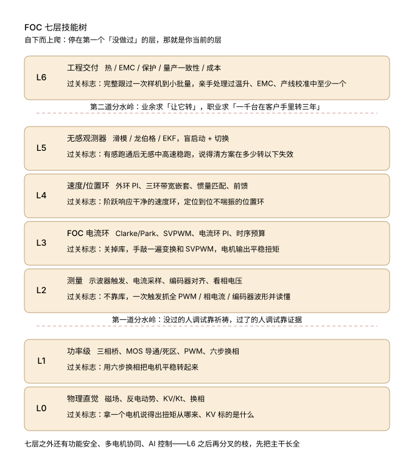

# awesome-FOC-motor-control · 电机控制 FOC 学习路径与资源精选

   

**A curated, path-based learning repository for FOC / PMSM / BLDC motor control — from physics intuition to production delivery. 电机控制资料不缺，缺的是顺序。**

当前收录：**26 条分层资源导航 · 11 个开源项目源码路径 · 9 条调试方法论 · 25 道面试场景题 · 2 张调试自检卡**（持续补充中）

> GitHub repo description（英文，建仓时直接用）：
> `A layered learning path & curated resources for FOC PMSM BLDC motor-control 电机控制: physics, power stage, measurement, current loop, field-oriented control, observers, production. Open source firmware (VESC/ODrive/SimpleFOC/moteus), tutorials, app notes, debugging notes.`

---

这不是一份链接清单，是一棵**七层技能树**。

电机控制的知识是严格分层的：上层的每个动作，都假设下层已经长在你手上了。下层没长出来就往上爬，不会学得慢，只会在某个固定位置彻底卡死——而且卡死的时候你会以为是算法不对、参数不对、板子不对。

进来先做一件事：拿每层的验收动作对一遍自己，停在第一个"没做过"上，那就是你当前的层。

## 七层技能树



```
L6 工程交付    热 / EMC / 保护 / 量产一致性 / 成本
              过关标志：完整跟过一次样机到小批量，亲手处理过温升、EMC、产线校准中至少一个
              ── 第二道分水岭：业余求"让它转"，职业求"一千台在客户手里转三年"
L5 无感观测器   滑模 / 龙伯格 / EKF，盲启动 + 切换
              过关标志：有感跑通后无感中高速稳跑，说得清方案在多少转以下失效
L4 速度/位置环  外环 PI、三环带宽嵌套、惯量匹配、前馈
              过关标志：阶跃响应干净的速度环，定位到位不喘振的位置环
L3 FOC 电流环  Clarke/Park、SVPWM、电流环 PI、时序预算
              过关标志：关掉库，手敲一遍变换和 SVPWM，电机输出平稳扭矩
L2 测量       示波器触发、电流采样、编码器对齐、看相电压
              过关标志：不靠库，自己一次触发抓全 PWM / 相电流 / 编码器波形并读懂
              ── 第一道分水岭：没过的人调试靠祈祷，过了的人调试靠证据
L1 功率级     三相桥、MOS 导通/死区、PWM、六步换相
              过关标志：用六步换相把电机平稳转起来
L0 物理直觉   磁场、反电动势、KV/Kt、换相
              过关标志：拿一个电机说得出扭矩从哪来、KV 标的是什么
```

七层之外还有功能安全、多电机协同、AI 控制——那些是 L6 之后再分叉的枝，先把主干长全。

**最小起步配置**：一块带三相驱动的开发板（B-G431B-ESC1 这类，或 SimpleFOC 生态板）+ 一个无刷电机 + 一台示波器。前三个月只干三件事：六步换相转起来、示波器把波形抓明白、手敲 FOC 跑电流环。

## 资料速取（30 秒上手）

不用爬完技能树才开始干活，这三样直接拿走用：

| 资料 | 拿走 | 什么时候用 |
|---|---|---|
| 📄 **《FOC面试高频25问·自测清单》**（18页 PDF，每题标技能层，附整棵技能树） | [interview/FOC面试高频25问_自测清单.pdf](interview/FOC面试高频25问_自测清单.pdf) · [在线阅读版 md](interview/FOC面试高频25问_自测清单.md) | 秋招/跳槽前 48 小时，先扫目录自测 |
| 📋 **示波器抓波自检 5 条**（卡片图，可存手机） | [checklists/示波器抓波自检清单.png](checklists/示波器抓波自检清单.png) | 拿到新板子，抓第一个波形之前 |
| 📋 **电流环自查 5 条**（卡片图，可存手机） | [checklists/电流环自查清单.png](checklists/电流环自查清单.png) | 电流环波形不干净，逐条对 |

25 问的用法：先扫目录自测，哪一层标记的题最多，就回哪一层补基本功——别在当前层死磕参数。卡壳的题对应的深入展开，见下面的文章索引。

## 深水区文章索引（持续更新）

文章都在公众号 **「电机控制深水区」**，按标题即可搜到。这里按技能树层归类，哪层卡补哪层：

| 层 | 文章 |
|---|---|
| L0 物理直觉 | 《电机控制七层技能树》 |
| L1 功率级 | 《拿到陌生电机，先别急着转》 |
| L2 测量 | 《技能树第二层：波形是假的》 |
| L3 电流环 | 《低速一顿一顿，真凶不是齿槽》 · 《技能树第三层：库能跑，换个电机就废》 |
| L4 速度/位置环 | 《三环不是三个PID》 · 《样本20角秒，实测零点几度》 |
| L6 工程交付 | 《跑赢博尔特，然后着火了》 · 《特斯拉审厂，先审你的简历》 |
| 面试 | 《会答FOC，追问就露馅》 |

## 快速导航

| 你在的层 | 先看什么 |
|---|---|
| L0–L1 | [教程论文与视频](resources/教程论文与视频.md) 里的 Microchip "DC 量的错觉"、TI Precision Labs 中文课、TI E2E BLDC FAQ |
| L2 | [调试与测量经验](resources/调试与测量经验.md) 第 1–3 条；SimpleFOC 文档站与论坛翻车帖 |
| L3 | [开源固件与项目](resources/开源固件与项目.md)（SimpleFOC → bldc_foc → ODrive 源码）；Wescott《PID Without a PhD》；慧驱动 60 讲 |
| L4 | ODrive 文档 tuning 章节、mjbots 博客；[调试经验](resources/调试与测量经验.md) 第 5–6 条 |
| L5 | Microchip AN1078（滑模）、TI SPRUHJ1I（FAST）、NXP AN14454（单电阻无感） |
| L6 | [开源固件与项目](resources/开源固件与项目.md) 里 VESC / moteus 的 CHANGELOG 与 issue 区；[调试经验](resources/调试与测量经验.md) 第 4、7、8 条 |
| 找工作 | [interview/FOC面试高频25问_自测清单.pdf](interview/FOC面试高频25问_自测清单.pdf)：25 题带层级、答题骨架和追问，盖住关键词自测，卡壳的题就是你的薄弱层 |
| 写固件 | [tools/](tools/README.md)：嵌入式 C 代码模板（CRC / 环形缓冲区 / PI 控制器等），模板在整理中，想优先看到哪个欢迎提 issue |

## 资源索引

- 📦 [resources/开源固件与项目.md](resources/开源固件与项目.md) — VESC / moteus / ODrive / SimpleFOC / AM32 对比（语言、许可证、活跃度、适合哪层人看、怎么读源码）
- 📚 [resources/教程论文与视频.md](resources/教程论文与视频.md) — 按 L0–L6 分层的教程、论文、厂商应用笔记和视频，每条标注入门/进阶
- 🔧 [resources/调试与测量经验.md](resources/调试与测量经验.md) — 示波器、电流采样、编码器对齐、炸管排查等实战方法论
- 📝 [interview/](interview/) — 秋招自测清单，25 题覆盖 L0–L6
- 📋 [checklists/](checklists/) — 调试现场用的自检卡片，抓波、电流环，一屏五条

## 关于我们

内容维护自微信公众号 **「电机控制深水区」**——嵌入式电机控制 / FOC / 电力电子方向的技术号，只写有波形、有参数、有踩坑的东西。微信搜公众号名称即可找到。

- **交流群**：关注公众号后回复「加群」
- **清单 PDF 版**：直接下载 [interview/FOC面试高频25问_自测清单.pdf](interview/FOC面试高频25问_自测清单.pdf)；也可以在公众号回复「面试」，微信里点开就能看（在线版，免下载）
- **面试题集**：《FOC面试10题》（逐题答案 + 追问链 + 面试官判分点）已在公众号发布
- **图文避坑笔记**：小红书「MotorMind」，调试现场的坑更快更短

## 贡献

欢迎 PR 和 issue：

- 补资源：链接必须是真实存在的一手源（官方仓库、厂商文档、原作者站点），附上适合哪一层的判断
- 改错误：数据失效（仓库活跃度、链接 404）、技术表述有误，直接提 issue 或 PR
- 加案例：[调试与测量经验](resources/调试与测量经验.md) 接受带波形和参数的真实排查案例

维护者精力有限，这个库靠大家一起保持新鲜。

## License

[MIT](LICENSE)，版权归「电机控制深水区」所有。链接指向的外部资源版权归原作者所有。
